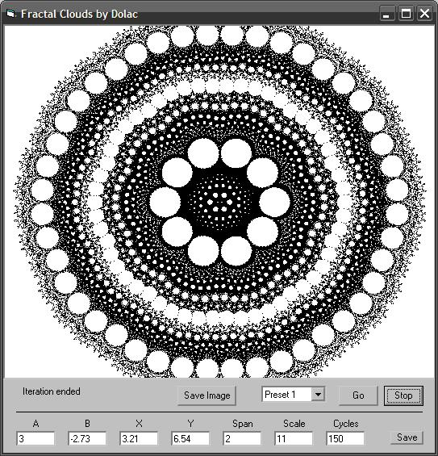



## Fractal Clouds with User Interface

### Description

This is Dolac's original Fractal Clouds with the addition of an interface that allows you to easily adjust parameters and find and save new patterns. Dolac's version can be found here http://www.Planet-Source-Code.com/vb/scripts/ShowCode.asp?txtCodeId=73814&lngWId=1

 

[ UPDATE: added resizing so now you can make nearly full screen clouds! ]
 
### More Info
 

             |
---                |---
**Submitted On**   |2011-04-05 13:08:22
**By**             |[Paul Bahlawan](https://github.com/Planet-Source-Code/PSCIndex/blob/master/ByAuthor/paul-bahlawan.md)
**Level**          |Beginner
**User Rating**    |5.0 (10 globes from 2 users)
**Compatibility**  |VB 6\.0
**Category**       |[Complete Applications](https://github.com/Planet-Source-Code/PSCIndex/blob/master/ByCategory/complete-applications__1-27.md)
**World**          |[Visual Basic](https://github.com/Planet-Source-Code/PSCIndex/blob/master/ByWorld/visual-basic.md)
**Archive File**   |[Fractal\_Cl220136452011\.zip](https://github.com/Planet-Source-Code/paul-bahlawan-fractal-clouds-with-user-interface__1-73846/archive/master.zip)

